# System Feature Dependency Graph

> **CRITICAL CONTRACT FOR AI ASSISTANTS & DEVELOPERS:**
> This graph is generated by `featuregraph`. 
> Always inspect dependencies before modifying or deleting code.

---

## 1. Visual Dependency Graph

```mermaid
graph TD
    ANNOTATOR-02["ANNOTATOR-02: Suggest python"] --> ANNOTATOR-01
    ANNOTATOR-03["ANNOTATOR-03: Suggest typescript"] --> ANNOTATOR-01
    ANNOTATOR-04["ANNOTATOR-04: Apply suggestions"] --> ANNOTATOR-01
    ANNOTATOR-05["ANNOTATOR-05: Collect suggestions"] --> ANNOTATOR-01
    ANNOTATOR-05["ANNOTATOR-05: Collect suggestions"] --> ANNOTATOR-02
    ANNOTATOR-05["ANNOTATOR-05: Collect suggestions"] --> ANNOTATOR-03
    ANNOTATOR-05["ANNOTATOR-05: Collect suggestions"] --> PARSER_GENERIC-01
    CLI-01["CLI-01: Main"] --> ANNOTATOR-04
    CLI-01["CLI-01: Main"] --> ANNOTATOR-05
    CLI-01["CLI-01: Main"] --> GIT_HOOK-01
    CLI-01["CLI-01: Main"] --> GIT_HOOK-02
    CLI-01["CLI-01: Main"] --> GIT_HOOK-03
    CLI-01["CLI-01: Main"] --> GRAPH-04
    CLI-01["CLI-01: Main"] --> HTML_VISUALI-01
    CLI-01["CLI-01: Main"] --> HTML_VISUALI-02
    CLI-01["CLI-01: Main"] --> JSON_FORMATT-01
    CLI-01["CLI-01: Main"] --> JSON_FORMATT-03
    CLI-01["CLI-01: Main"] --> MARKDOWN_FOR-01
    CLI-01["CLI-01: Main"] --> SCANNER-01
    CLI-01["CLI-01: Main"] --> SCANNER-02
    CLI-01["CLI-01: Main"] --> SCANNER-03
    CLI-01["CLI-01: Main"] --> SKILL-01
    JSON_FORMATT-01["JSON_FORMATT-01: Jsonformatter"] --> JSON_FORMATT-02
    JSON_FORMATT-03["JSON_FORMATT-03: Write to file"] --> JSON_FORMATT-01
    JSON_FORMATT-03["JSON_FORMATT-03: Write to file"] --> JSON_FORMATT-02
    MARKDOWN_FOR-01["MARKDOWN_FOR-01: Markdown formatter"] --> JSON_FORMATT-02
    MARKDOWN_FOR-03["MARKDOWN_FOR-03: Write to file"] --> JSON_FORMATT-02
    MARKDOWN_FOR-03["MARKDOWN_FOR-03: Write to file"] --> MARKDOWN_FOR-01
    SCANNER-01["SCANNER-01: Workspace scanner"] --> DEP_RESOLVER-01
    SCANNER-01["SCANNER-01: Workspace scanner"] --> DEP_RESOLVER-02
    SCANNER-01["SCANNER-01: Workspace scanner"] --> DEP_RESOLVER-03
    SCANNER-01["SCANNER-01: Workspace scanner"] --> GRAPH-01
    SCANNER-01["SCANNER-01: Workspace scanner"] --> GRAPH-02
    SCANNER-01["SCANNER-01: Workspace scanner"] --> PARSER_GENERIC-01
    SCANNER-01["SCANNER-01: Workspace scanner"] --> PARSER_PY-01
    SCANNER-01["SCANNER-01: Workspace scanner"] --> PARSER_PY-02
    SCANNER-01["SCANNER-01: Workspace scanner"] --> PARSER_TS-01
    SCANNER-03["SCANNER-03: Scan"] --> DEP_RESOLVER-01
    SCANNER-03["SCANNER-03: Scan"] --> DEP_RESOLVER-02
    SCANNER-03["SCANNER-03: Scan"] --> DEP_RESOLVER-03
```

---
## 2. Feature Map & Exact Line Reference Matrix

| Feature ID | Feature Name | Description | Depends On | Called By | Exact Line References |
| :--- | :--- | :--- | :--- | :--- | :--- |
| **`ANNOTATOR-01`** | **Suggestion** | — | — | `[ANNOTATOR-02]` `[ANNOTATOR-03]` `[ANNOTATOR-04]` `[ANNOTATOR-05]` | [`featuregraph/core/annotator.py#L38-L45`](featuregraph/core/annotator.py#L38-L45) |
| **`ANNOTATOR-02`** | **Suggest python** | — | `[ANNOTATOR-01]` | `[ANNOTATOR-05]` | [`featuregraph/core/annotator.py#L105-L149`](featuregraph/core/annotator.py#L105-L149) |
| **`ANNOTATOR-03`** | **Suggest typescript** | — | `[ANNOTATOR-01]` | `[ANNOTATOR-05]` | [`featuregraph/core/annotator.py#L165-L201`](featuregraph/core/annotator.py#L165-L201) |
| **`ANNOTATOR-04`** | **Apply suggestions** | — | `[ANNOTATOR-01]` | `[CLI-01]` | [`featuregraph/core/annotator.py#L268-L304`](featuregraph/core/annotator.py#L268-L304) |
| **`ANNOTATOR-05`** | **Collect suggestions** | — | `[ANNOTATOR-01]` `[ANNOTATOR-02]` `[ANNOTATOR-03]` `[PARSER_GENERIC-01]` | `[CLI-01]` | [`featuregraph/core/annotator.py#L318-L357`](featuregraph/core/annotator.py#L318-L357) |
| **`CLI-01`** | **Main** | — | `[ANNOTATOR-04]` `[ANNOTATOR-05]` `[GIT_HOOK-01]` `[GIT_HOOK-02]` `[GIT_HOOK-03]` `[GRAPH-04]` `[HTML_VISUALI-01]` `[HTML_VISUALI-02]` `[JSON_FORMATT-01]` `[JSON_FORMATT-03]` `[MARKDOWN_FOR-01]` `[SCANNER-01]` `[SCANNER-02]` `[SCANNER-03]` `[SKILL-01]` | — | [`featuregraph/cli.py#L20-L268`](featuregraph/cli.py#L20-L268) |
| **`DEP_RESOLVER-01`** | **Dependency Resolver** | — | — | `[SCANNER-01]` `[SCANNER-03]` | [`featuregraph/core/dependency_resolver.py#L27-L128`](featuregraph/core/dependency_resolver.py#L27-L128) |
| **`DEP_RESOLVER-02`** | **Register symbols** | — | — | `[SCANNER-01]` `[SCANNER-03]` | [`featuregraph/core/dependency_resolver.py#L37-L43`](featuregraph/core/dependency_resolver.py#L37-L43) |
| **`DEP_RESOLVER-03`** | **Resolve dependencies for file** | — | — | `[SCANNER-01]` `[SCANNER-03]` | [`featuregraph/core/dependency_resolver.py#L46-L69`](featuregraph/core/dependency_resolver.py#L46-L69) |
| **`GIT_HOOK-01`** | **Git hook manager** | — | — | `[CLI-01]` | [`featuregraph/hooks/git_hook.py#L13-L35`](featuregraph/hooks/git_hook.py#L13-L35) |
| **`GIT_HOOK-02`** | **Install** | — | — | `[CLI-01]` | [`featuregraph/hooks/git_hook.py#L18-L26`](featuregraph/hooks/git_hook.py#L18-L26) |
| **`GIT_HOOK-03`** | **Uninstall** | — | — | `[CLI-01]` | [`featuregraph/hooks/git_hook.py#L30-L35`](featuregraph/hooks/git_hook.py#L30-L35) |
| **`GRAPH-01`** | **Feature graph** | — | — | `[SCANNER-01]` `[SCANNER-03]` `[TEST_SCANNER-01]` `[TEST_SCANNER-02]` | [`featuregraph/core/graph.py#L4-L68`](featuregraph/core/graph.py#L4-L68) |
| **`GRAPH-02`** | **Add feature** | — | — | `[SCANNER-01]` `[SCANNER-03]` `[TEST_SCANNER-01]` `[TEST_SCANNER-02]` | [`featuregraph/core/graph.py#L13-L35`](featuregraph/core/graph.py#L13-L35) |
| **`GRAPH-03`** | **Get orphans** | — | — | `[TEST_SCANNER-02]` | [`featuregraph/core/graph.py#L38-L44`](featuregraph/core/graph.py#L38-L44) |
| **`GRAPH-04`** | **To dict** | — | — | `[CLI-01]` `[TEST_SCANNER-01]` | [`featuregraph/core/graph.py#L47-L68`](featuregraph/core/graph.py#L47-L68) |
| **`HTML_VISUALI-01`** | **Htmlvisualizer** | — | — | `[CLI-01]` | [`featuregraph/formatters/html_visualizer.py#L6-L159`](featuregraph/formatters/html_visualizer.py#L6-L159) |
| **`HTML_VISUALI-02`** | **Generate** | — | — | `[CLI-01]` | [`featuregraph/formatters/html_visualizer.py#L11-L159`](featuregraph/formatters/html_visualizer.py#L11-L159) |
| **`JSON_FORMATT-01`** | **Jsonformatter** | — | `[JSON_FORMATT-02]` | `[CLI-01]` `[JSON_FORMATT-03]` | [`featuregraph/formatters/json_formatter.py#L12-L33`](featuregraph/formatters/json_formatter.py#L12-L33) |
| **`JSON_FORMATT-02`** | **Format** | — | — | `[JSON_FORMATT-01]` `[JSON_FORMATT-03]` `[MARKDOWN_FOR-01]` `[MARKDOWN_FOR-03]` | [`featuregraph/formatters/json_formatter.py#L17-L27`](featuregraph/formatters/json_formatter.py#L17-L27) |
| **`JSON_FORMATT-03`** | **Write to file** | — | `[JSON_FORMATT-01]` `[JSON_FORMATT-02]` | `[CLI-01]` | [`featuregraph/formatters/json_formatter.py#L31-L33`](featuregraph/formatters/json_formatter.py#L31-L33) |
| **`MARKDOWN_FOR-01`** | **Markdown formatter** | — | `[JSON_FORMATT-02]` | `[CLI-01]` `[MARKDOWN_FOR-03]` | [`featuregraph/formatters/markdown_formatter.py#L5-L72`](featuregraph/formatters/markdown_formatter.py#L5-L72) |
| **`MARKDOWN_FOR-02`** | **Format** | — | — | — | [`featuregraph/formatters/markdown_formatter.py#L10-L66`](featuregraph/formatters/markdown_formatter.py#L10-L66) |
| **`MARKDOWN_FOR-03`** | **Write to file** | — | `[JSON_FORMATT-02]` `[MARKDOWN_FOR-01]` | — | [`featuregraph/formatters/markdown_formatter.py#L70-L72`](featuregraph/formatters/markdown_formatter.py#L70-L72) |
| **`PARSER_GENERIC-01`** | **Generic Feature Parser** | — | — | `[ANNOTATOR-05]` `[SCANNER-01]` `[SCANNER-03]` | [`featuregraph/core/parser_generic.py#L59-L196`](featuregraph/core/parser_generic.py#L59-L196) |
| **`PARSER_PY-01`** | **Python feature parser** | — | — | `[SCANNER-01]` `[SCANNER-03]` | [`featuregraph/core/parser_py.py#L10-L95`](featuregraph/core/parser_py.py#L10-L95) |
| **`PARSER_PY-02`** | **Parse file** | — | — | `[SCANNER-01]` `[SCANNER-03]` | [`featuregraph/core/parser_py.py#L15-L95`](featuregraph/core/parser_py.py#L15-L95) |
| **`PARSER_TS-01`** | **Type script feature parser** | — | — | `[SCANNER-01]` `[SCANNER-03]` | [`featuregraph/core/parser_ts.py#L11-L62`](featuregraph/core/parser_ts.py#L11-L62) |
| **`PARSER_TS-02`** | **Parse file** | — | — | — | [`featuregraph/core/parser_ts.py#L16-L62`](featuregraph/core/parser_ts.py#L16-L62) |
| **`SCANNER-01`** | **Workspace scanner** | — | `[DEP_RESOLVER-01]` `[DEP_RESOLVER-02]` `[DEP_RESOLVER-03]` `[GRAPH-01]` `[GRAPH-02]` `[PARSER_GENERIC-01]` `[PARSER_PY-01]` `[PARSER_PY-02]` `[PARSER_TS-01]` | `[CLI-01]` | [`featuregraph/core/scanner.py#L17-L104`](featuregraph/core/scanner.py#L17-L104) |
| **`SCANNER-02`** | **Detect subprojects** | — | — | `[CLI-01]` | [`featuregraph/core/scanner.py#L26-L36`](featuregraph/core/scanner.py#L26-L36) |
| **`SCANNER-03`** | **Scan** | — | `[DEP_RESOLVER-01]` `[DEP_RESOLVER-02]` `[DEP_RESOLVER-03]` `[GRAPH-01]` `[GRAPH-02]` `[PARSER_GENERIC-01]` `[PARSER_PY-01]` `[PARSER_PY-02]` `[PARSER_TS-01]` | `[CLI-01]` | [`featuregraph/core/scanner.py#L52-L104`](featuregraph/core/scanner.py#L52-L104) |
| **`SKILL-01`** | **Skill Manager** | — | — | `[CLI-01]` | [`featuregraph/skills/skill_manager.py#L146-L183`](featuregraph/skills/skill_manager.py#L146-L183) |
| **`TEST_SCANNER-01`** | **Test graph dependencies** | — | `[GRAPH-01]` `[GRAPH-02]` `[GRAPH-04]` | — | [`tests/test_scanner.py#L9-L17`](tests/test_scanner.py#L9-L17) |
| **`TEST_SCANNER-02`** | **Test orphan detection** | — | `[GRAPH-01]` `[GRAPH-02]` `[GRAPH-03]` | — | [`tests/test_scanner.py#L20-L23`](tests/test_scanner.py#L20-L23) |

---

## 3. Token-Efficient Reading Protocol

When working on any feature:
1. Lookup `FEATURE_INDEX.json` to get the exact line slice (`#Lstart-Lend`).
2. Read **only** those lines with your editor tool.
3. Check `[Depends On]` features before committing changes.
